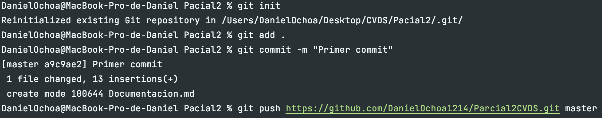
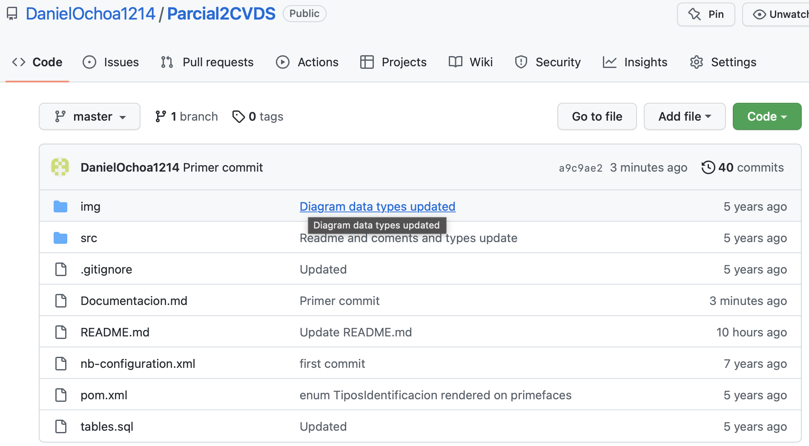

## Daniel Sebastian Ochoa Urrego

### CVDS – Ciclos de Vida Desarrollo de Software
### Parcial Segundo Tercio

Lo primero que se hizo fue clonar el proyecto a la maquina local con el comando 

    git clone https://github.com/isanchezf/2022-2-par2t.git master

Y se creo un repositorio remoto en mi cuenta personal de GitHub y subimos el parcial

