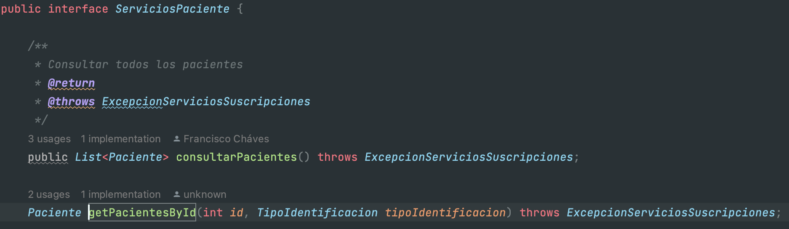

## Daniel Sebastian Ochoa Urrego

### CVDS – Ciclos de Vida Desarrollo de Software
### Parcial Segundo Tercio

Lo primero que se hizo fue clonar el proyecto a la maquina local con el comando 

    git clone https://github.com/isanchezf/2022-2-par2t.git master

Y se creo un repositorio remoto en mi cuenta personal de GitHub y subimos el parcial

#### Primer punto
#### Segundo punto

Lo primero que hay que hacer para que este punto se pueda hacer es cambiar el archivo de config.properties y poner las credenciales correctas para poder realizar la coneccion con el servidor, se debe cambar la contraseña de autenticacion por "prueba2019"

Luego de esto se empieza implementando la consulta en SQL en el archivo "PacienteMapper.xml" 

Y ya que las consultas del paciente son un atributo de lista, este se mapeo se debe especificar en otro resultMap que esta en el archivo ConsultaMapper.xml

Y ahora creamos la función getPacientesById en el PacienteMapper de Java para poder usarlo en el los DAO

Luego tanto en la interfaz DAO como en su implementación se le agrega un metodo load que llame al metodo getPacienteById en el PacienteMapper

Luego tanto en la interfaz del servicio como en la implementación de esta añadimos un metodo getPacienteById en el que se llama al metodo load creado anteriormente

Luego en el bean solo le añadimos un atributo de paciente y una función loadPacienteById ya que ya se tenia implementado el tipo de identificación en el proyecto entregado en el enunciado

Y por ultimo debemos crear la pagina en xhtml en el archivo "consultaPaciente.xhtml" haciendo todos los respectivos bindings entre los componentes de la pagina y los atributos de donde se sacaran los
datos en el Bean, ademas de conectar la función loadPaciente del Bean con el click del botón de "Consultar"

#### Tercer punto 

